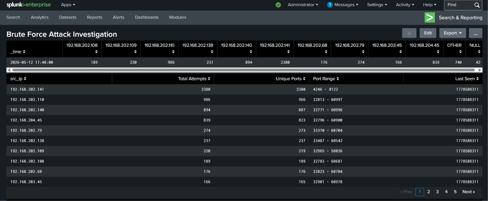
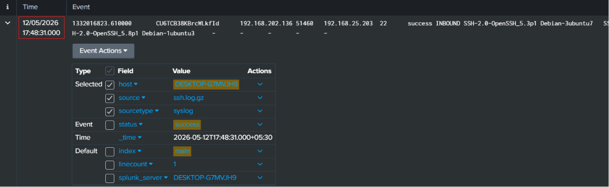
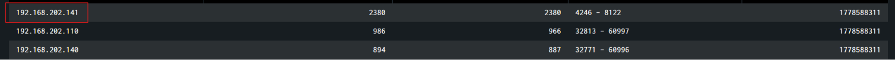
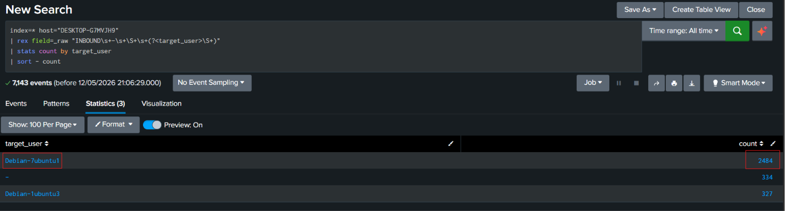
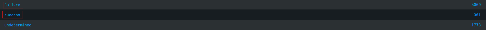

# SSH Brute Force Attack Investigation

## Overview
This project demonstrates a SOC investigation of SSH brute-force activity using log analysis in Splunk.  
The logs were collected from publicly available SSH authentication datasets and analyzed to identify suspicious login attempts, targeted usernames, attack patterns, and successful authentications.

---

# Investigation Objectives

- Detect brute-force SSH activity
- Identify top attacking IP addresses
- Determine targeted usernames
- Investigate successful logins
- Analyze attack behavior and patterns
- Create a SOC-style dashboard in Splunk

---

# Tools Used

- Splunk Enterprise
- Linux SSH Logs
- Syslog Authentication Events

---

# Dashboard

## Brute Force Attack Dashboard

---

# The 5 SOC Investigation Questions

---

## 1. What Happened?

A brute-force SSH attack was detected against multiple Linux systems.  
Attackers attempted thousands of SSH authentication attempts against different usernames and systems.

The investigation identified:
- Large volumes of failed login attempts
- Multiple source IPs involved
- Repeated targeting of specific usernames
- Successful logins after repeated failures

---

## 2. When Did It Happen?

The attack activity was observed on:

- **Date:** 12/05/2026
- **Time:** 17:48:31

Evidence from Splunk logs:

---

## 3. Where Did It Happen?

The attack targeted Linux SSH services running on internal systems.

Primary targeted systems included:
- Debian-7ubuntu1
- Debian-1ubuntu3

Target service:
- SSH (Port 22)

---

## 4. Who Was Involved?

### Top Attacking IP Address

- **192.168.202.141**
- Total Attempts: **2380**

Other highly active IPs:
- 192.168.202.110
- 192.168.202.140
- 192.168.204.45

Evidence:

---

### Most Targeted Username

- **Debian-7ubuntu1**
- Total Attempts: **2484**

Evidence:

---

### Username Targeted From Multiple IPs

The account `Debian-7ubuntu1` was targeted from multiple attacking IP addresses.

Evidence:

---

## 5. How Did It Happen?

Attackers used automated brute-force techniques against SSH authentication services.

Indicators included:
- Thousands of repeated login attempts
- Multiple usernames tested
- Large number of failed authentications
- High-frequency SSH connection attempts
- Successful logins following repeated failures

Authentication statistics:
- Failed Attempts: 5069
- Successful Logins: 301
- Undetermined Events: 1773

Evidence:

---

# Investigation Findings

| Finding | Result |
|---|---|
| Top Attacking IP | 192.168.202.141 |
| Highest Attempts | 2380 |
| Most Targeted Username | Debian-7ubuntu1 |
| Failed Login Attempts | 5069 |
| Successful Logins | 301 |
| Target Service | SSH |
| Target Port | 22 |

---

# MITRE ATT&CK Mapping

| Technique ID | Technique |
|---|---|
| T1110 | Brute Force |
| T1078 | Valid Accounts |

---

# Indicators of Compromise (IOCs)

| Type | Value |
|---|---|
| Malicious IP | 192.168.202.141 |
| Malicious IP | 192.168.202.110 |
| Malicious IP | 192.168.202.140 |
| Target Username | Debian-7ubuntu1 |
| Service | SSH |
| Port | 22 |

---

# Recommendations

- Enable Multi-Factor Authentication (MFA)
- Disable password-based SSH authentication
- Use SSH keys instead of passwords
- Restrict SSH access using firewall rules
- Implement Fail2Ban
- Monitor repeated failed login attempts
- Block malicious IP addresses

---

# Conclusion

The investigation confirmed active SSH brute-force activity against Linux systems.  
Attackers used multiple IP addresses to repeatedly attempt SSH authentication against targeted usernames.  
Several successful login events were also identified, indicating potential account compromise.

This project demonstrates practical SOC investigation and log analysis skills using Splunk.

---

# Disclaimer

This project was created for educational and defensive cybersecurity purposes only.