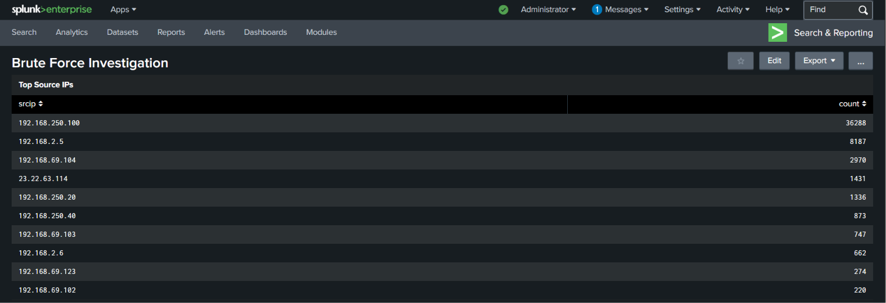
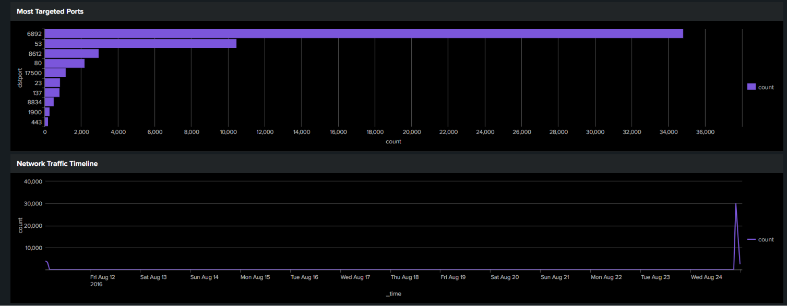
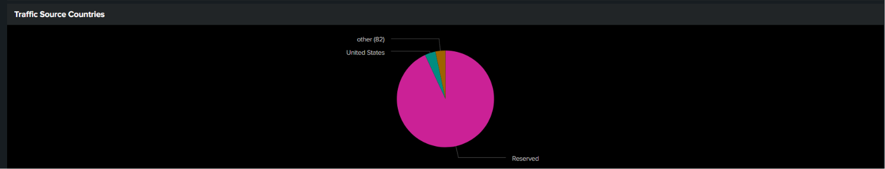

# Fortigate Firewall Monitoring Dashboard Investigation Report

## Overview

This investigation was conducted using Splunk Enterprise and the BOTS dataset to analyze Fortigate firewall traffic logs. The objective was to identify suspicious network behavior, targeted services, abnormal traffic patterns, and possible reconnaissance activity.

---

# Dashboard Overview

---

# Top Source IP Analysis

The firewall traffic logs showed that the IP address `192.168.250.100` generated the highest amount of traffic with over 36,000 events.

Other highly active systems included:
- 192.168.2.5
- 192.168.69.104
- 23.22.63.114

## Findings

- `192.168.250.100` appeared significantly more active than other hosts.
- External IP address `23.22.63.114` communicated frequently with internal systems.
- High traffic volume may indicate:
  - automated activity
  - scanning behavior
  - centralized server communication
  - suspicious network behavior requiring further investigation

## Security Impact

Unusually high traffic from a single source may indicate:
- reconnaissance activity
- malware communication
- brute-force attempts
- network scanning behavior

---

# Investigation of High Traffic Source IP

The source IP address `192.168.250.100` generated the highest number of firewall events within the dataset.

## Observed Activity

- Multiple denied connections were detected.
- Traffic targeted broadcast address `192.168.250.255`.
- Ports `137` and `138` were frequently used.
- The detected service was identified as `NetBIOS`.

## Analysis

NetBIOS traffic is commonly associated with:
- host discovery
- file sharing
- legacy Windows networking

The repeated denied traffic suggests the firewall successfully blocked suspicious or unauthorized communication attempts.

The behavior may indicate:
- internal reconnaissance activity
- excessive broadcast traffic
- automated network scanning behavior

## Security Impact

Although the firewall denied the traffic, the unusually high event volume from a single internal source may warrant further monitoring and investigation.

---

# Most Targeted Ports Analysis

Analysis of destination ports identified several frequently targeted services within the network traffic logs.

## Observed Ports

| Port | Service |
|---|---|
| 22 | SSH |
| 23 | Telnet |
| 80 | HTTP |
| 443 | HTTPS |
| 445 | SMB |
| 137/138 | NetBIOS |

## Findings

- Port 23 (Telnet) generated a high number of events, which may indicate insecure remote access attempts or scanning behavior.
- SSH traffic on port 22 was also observed, suggesting remote administration activity or possible brute-force targeting.
- SMB traffic on port 445 may indicate Windows file-sharing communication or lateral movement attempts.
- NetBIOS-related ports 137 and 138 showed repeated activity associated with internal network discovery traffic.

## Security Impact

The concentration of traffic on administrative and legacy service ports may indicate:
- reconnaissance activity
- unauthorized scanning
- remote access attempts
- suspicious internal communication

---

# Network Traffic Timeline

The traffic timeline visualization identified fluctuations and spikes in firewall traffic volume over time.

## Findings

- Multiple spikes in network traffic were observed.
- Increased traffic volume may indicate scanning activity or periods of elevated network communication.
- Monitoring traffic patterns helps identify anomalies and suspicious behavior.

---

# Traffic Source Countries

Analysis of traffic source countries identified external communication originating from multiple geographic regions.

## Findings

- Traffic originated from several countries.
- Foreign traffic sources may indicate external scanning or internet-facing communication attempts.
- Geographic analysis assists in identifying unusual or suspicious access patterns.

---

# Possible Port Scanning Activity

The analysis identified network behavior consistent with possible port scanning and reconnaissance activity.

## Observed Behavior

- Multiple source IPs attempted communication across several destination ports.
- Traffic targeted administrative and remote-access related services.
- Several suspicious connections were denied by the firewall.

## Analysis

The behavior is consistent with reconnaissance or automated port scanning activity commonly performed before exploitation attempts.

Port scanning is often used by attackers to:
- identify exposed services
- detect vulnerable systems
- map internal networks

## Security Impact

The firewall successfully blocked portions of the suspicious traffic; however, the scanning behavior indicates potential malicious probing activity within the network.

---

# Allowed vs Blocked Traffic

The firewall logs showed both allowed and denied network traffic events.

## Findings

- Multiple denied connections were detected.
- Firewall filtering prevented potentially suspicious traffic from reaching internal systems.
- Blocked traffic indicates active network defense mechanisms.

---

# Conclusion

The investigation identified multiple indicators of suspicious network activity within the Fortigate firewall logs, including:

- abnormal traffic volume
- repeated denied connections
- NetBIOS-related communication
- Telnet and SSH targeting
- potential reconnaissance behavior
- possible port scanning activity

The firewall successfully blocked several suspicious connection attempts, demonstrating active traffic filtering and threat mitigation capabilities.

Continuous monitoring and further investigation of high-volume hosts and targeted services is recommended to reduce the risk of unauthorized access and network compromise.