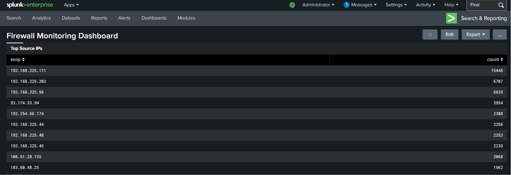
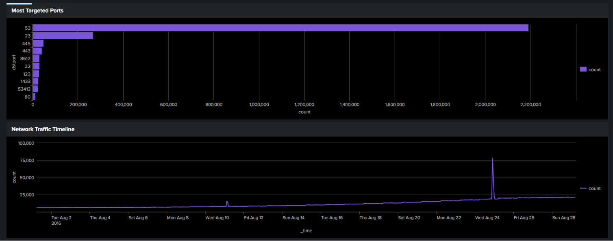
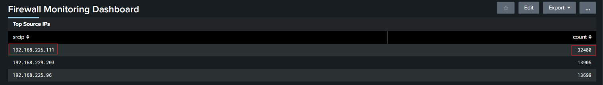
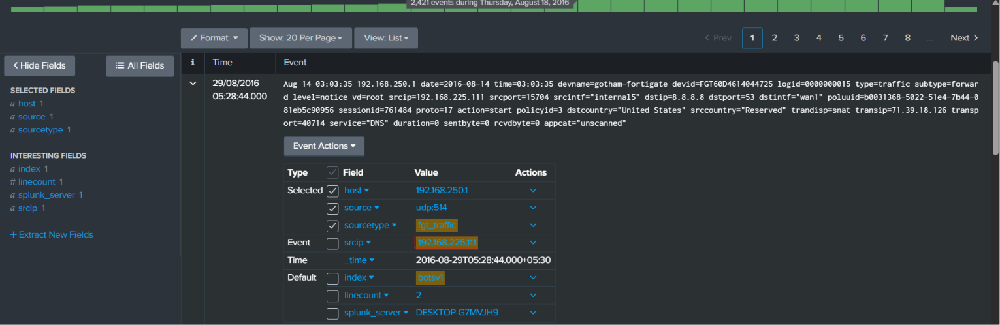
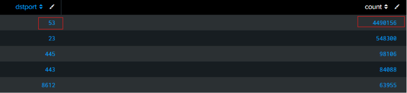
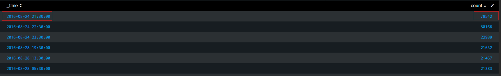
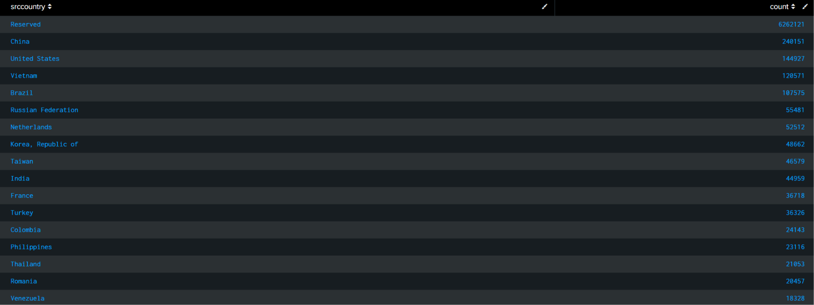

# Fortigate Firewall Monitoring Dashboard Investigation Report

## Overview

This investigation was conducted using Splunk Enterprise with the BOTS dataset to monitor and analyze Fortigate firewall traffic logs. The objective was to identify suspicious network behavior, abnormal traffic spikes, targeted services, and potential reconnaissance activity within the environment.

---

# Dashboard Overview

The dashboard provides visibility into:
- Top source IP addresses
- Most targeted destination ports
- Traffic spikes over time
- Geographic traffic distribution
- Firewall traffic behavior analysis

---

# Top Source IP Analysis

The firewall logs revealed that the IP address `192.168.225.111` generated the highest amount of traffic with approximately `32,480` events.

Other highly active source IPs included:
- `192.168.229.203`
- `192.168.225.96`

## Findings

- `192.168.225.111` produced significantly more firewall events than other systems.
- The high event count may indicate:
  - automated activity
  - internal scanning behavior
  - excessive service communication
  - suspicious network activity

## Security Impact

Large volumes of traffic from a single source may indicate:
- reconnaissance behavior
- malware communication
- internal scanning
- abnormal system activity

Continuous monitoring of this host is recommended.

---

# Investigation of High Traffic Source IP

Further investigation of source IP `192.168.225.111` revealed detailed Fortigate firewall events associated with the host.

## Observed Activity

- Traffic originated from internal source IP `192.168.225.111`
- Destination communication involved external IP addresses
- The logs showed UDP traffic activity
- The detected service was identified as `DNS`
- Multiple traffic forwarding events were observed

## Analysis

The firewall logs indicate the system was generating repeated DNS-related communication.

Possible explanations include:
- automated DNS requests
- excessive network communication
- beaconing behavior
- malware-related DNS traffic
- abnormal host activity

The unusually high number of firewall events generated by this host makes it suspicious compared to other systems in the environment.

## Security Impact

High-volume DNS traffic may indicate:
- command-and-control communication
- malware beaconing
- automated scripts
- suspicious background processes

Further endpoint investigation is recommended to determine the root cause of the activity.

---

# Most Targeted Ports Analysis

Analysis of destination ports identified several heavily targeted services within the firewall traffic logs.

## Observed Ports

| Port | Service |
|---|---|
| 53 | DNS |
| 23 | Telnet |
| 445 | SMB |
| 443 | HTTPS |
| 8612 | Unknown / Custom Service |

## Findings

- Port `53` (DNS) generated the highest number of events with over `2.2 million` connections.
- Port `23` (Telnet) showed a significant number of connection attempts, which may indicate insecure remote-access activity or scanning behavior.
- SMB traffic on port `445` may indicate Windows file-sharing communication or lateral movement attempts.
- HTTPS traffic on port `443` indicates encrypted web communication activity.

## Security Impact

Heavy targeting of administrative and network-related services may indicate:
- reconnaissance activity
- automated scanning
- suspicious communication
- remote-access attempts
- malware-related traffic

The extremely high volume of DNS traffic should be investigated further.

---

# Network Traffic Timeline

The traffic timeline visualization identified fluctuations and spikes in firewall traffic volume over time.

## Findings

- A major traffic spike was observed on:
  - `2016-08-24 21:30:00`
- The spike generated approximately `78,542` events during the observed period.
- Several smaller spikes were also identified throughout the dataset.

## Analysis

Traffic spikes may indicate:
- scanning activity
- malware communication bursts
- automated scripts
- unusual network behavior
- large-scale service communication

## Security Impact

Sudden increases in network traffic may represent suspicious or unauthorized activity and should be correlated with endpoint and authentication logs for further investigation.

---

# Traffic Source Countries

Geographic analysis was performed to identify the origin countries associated with firewall traffic events.

## Top Countries Observed

| Country | Event Count |
|---|---|
| Reserved | 6,262,121 |
| China | 240,151 |
| United States | 144,927 |
| Vietnam | 120,571 |
| Brazil | 107,575 |

## Findings

- A large portion of traffic originated from `Reserved` address space, indicating internal or non-public network communication.
- External traffic was observed from multiple countries including:
  - China
  - United States
  - Vietnam
  - Brazil
  - Russian Federation

## Security Impact

Traffic from multiple geographic regions may indicate:
- internet-facing communication
- external scanning attempts
- suspicious inbound activity
- global probing behavior

Geographic analysis helps identify unusual access patterns and potential threat sources.

---

# Firewall Traffic Behavior Analysis

The firewall logs revealed several indicators of potentially suspicious network behavior.

## Observed Behavior

- High DNS traffic volume
- Frequent Telnet-related communication
- SMB traffic activity
- Repeated firewall forwarding events
- Abnormal traffic spikes

## Analysis

The observed behavior may indicate:
- reconnaissance activity
- automated network communication
- insecure service usage
- possible malware communication
- excessive internal traffic generation

The combination of DNS-heavy traffic and abnormal spikes warrants additional investigation.

---

# Conclusion

The investigation identified multiple indicators of suspicious and abnormal network activity within the Fortigate firewall logs, including:

- unusually high traffic from `192.168.225.111`
- excessive DNS communication
- Telnet-related traffic activity
- SMB service communication
- abnormal traffic spikes
- external communication from multiple countries

The firewall successfully logged and monitored the suspicious traffic activity, providing visibility into network behavior and potential threats.

Further investigation of high-volume hosts, DNS activity, and Telnet communication is recommended to reduce the risk of unauthorized access, malware activity, or network compromise.